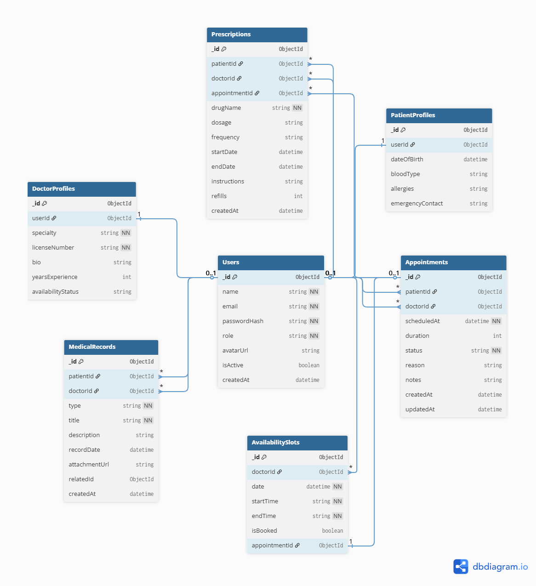

# VitalSync — Healthcare Patient Management System

> A hospital-grade web platform for managing doctor-patient interactions, appointments, medical records, and prescriptions. Built as an industry-level capstone project demonstrating full-stack engineering with real-world business logic, role-based access control, and a production-quality user interface.

---

## Intern Information

| Field | Details |
|---|---|
| Project Name | VitalSync |
| Track | Fullstack |
| Cohort | ProDesk Internship — 2026 |
| Repository | `prodesk-capstone-VitalSync` |

---

## Table of Contents

1. [Project Overview](#project-overview)
2. [Tech Stack](#tech-stack)
3. [User Roles and Permissions](#user-roles-and-permissions)
4. [Core Features](#core-features)
5. [Appointment Conflict Detection Logic](#appointment-conflict-detection-logic)
6. [Data Scoping and Privacy Model](#data-scoping-and-privacy-model)
7. [Database Architecture](#database-architecture)
8. [API Endpoints](#api-endpoints)
9. [Folder Structure](#folder-structure)
10. [Environment Variables](#environment-variables)
11. [Getting Started](#getting-started)
12. [Figma Designs](#figma-designs)
13. [Deployment](#deployment)
14. [Future Scope](#future-scope)

---

## Project Overview

VitalSync is a fullstack healthcare management platform inspired by real-world hospital software systems. The platform serves two types of authenticated users — Patients and Doctors — each with a completely separate dashboard, permission set, and user experience.

The core problem VitalSync solves is the fragmentation of patient health data. In most small-to-mid-scale clinical setups, appointment booking, prescription management, and medical history are handled across separate tools or paper records. VitalSync consolidates all of this into a single, role-aware web application where every piece of data is scoped strictly to the users who are authorized to see it.

The system handles appointment booking with server-side conflict detection, a chronological medical history timeline, prescription lifecycle management covering creation, active tracking, and expiry, and live doctor availability status powered by Socket.io. Patient data is never exposed beyond the treating doctor, and no global data view exists anywhere in the system by design.

This project is designed to reflect the architecture, code organization, and UI quality expected in a production healthcare SaaS product.

---

## Tech Stack

### Frontend

| Technology | Purpose |
|---|---|
| Next.js 14 (App Router) | React framework with file-based routing and server components |
| Tailwind CSS | Utility-first CSS framework for all styling |
| shadcn/ui | Accessible component library built on Radix UI |
| Zustand | Lightweight client-side state management |
| React Hook Form | Form state management and validation |
| Zod | Schema validation for forms and API responses |
| Axios | HTTP client for API requests with interceptor-based auth headers |
| Socket.io-client | Real-time doctor availability status updates |
| date-fns | Date formatting and manipulation throughout the UI |

### Backend

| Technology | Purpose |
|---|---|
| Node.js | JavaScript runtime for the server |
| Express.js | REST API framework |
| MongoDB | Primary NoSQL database |
| Mongoose | ODM for MongoDB schema definition and querying |
| NextAuth.js | Authentication with JWT strategy and session management |
| bcryptjs | Password hashing with 12 salt rounds |
| Socket.io | WebSocket server for real-time doctor presence |
| Joi | Server-side request body validation |
| cors | Cross-origin resource sharing configuration |
| dotenv | Environment variable management |

### Infrastructure and Tooling

| Technology | Purpose |
|---|---|
| Vercel | Frontend deployment and CI/CD |
| Railway | Backend API and MongoDB deployment |
| GitHub Actions | Automated linting and build checks on pull requests |
| ESLint + Prettier | Code style enforcement across the entire codebase |
| Postman | API development and manual endpoint testing |
| dbdiagram.io | ERD design and documentation |

---

## User Roles and Permissions

VitalSync implements strict role-based access control enforced at both the route middleware level on the server and the Next.js middleware level on the client. There are exactly two roles. There is no superuser, administrator, or global data view anywhere in the system. This is a deliberate architectural decision to protect the privacy of both patients and doctors.

### Patient

A patient can register and log in independently. Once authenticated, a patient can browse available doctors filtered by specialty, book appointments from a doctor's available time slots, view their own complete chronological medical history, read their own active and expired prescriptions, and update their own personal profile.

A patient cannot view another patient's records under any circumstance. A patient cannot access any doctor-only routes. A patient cannot modify an appointment that has already been confirmed or completed.

### Doctor

A doctor account is created through the registration flow with a valid medical license number. Once logged in, a doctor can define their weekly availability windows, view their daily and weekly appointment schedule, access the profile and medical history of patients they have an active or completed appointment with, write and issue prescriptions linked to a specific appointment, update appointment status across the state machine, and toggle their real-time availability status.

A doctor cannot access the records of any patient outside their direct care. The backend enforces this at the query level, not at the UI level. This distinction is documented in detail in the Data Scoping and Privacy Model section below.

---

## Core Features

### Authentication and Authorization

- JWT-based authentication with secure HttpOnly cookie storage
- Role declaration at registration with server-side role verification on every protected request
- Protected routes enforced at Next.js middleware level using the session role claim
- Separate post-login redirects rendering completely different dashboards per role
- Password hashing with bcryptjs at 12 salt rounds, hash never returned in any API response
- Session persistence with NextAuth.js and configurable token expiry

### Patient Dashboard

- Summary stat cards showing upcoming appointments count, active prescriptions count, and last visit date
- Real-time list of available doctors with a live status indicator showing available, busy, or offline
- Doctor filter by specialty covering General, Cardiology, Neurology, Dermatology, and Pediatrics
- Recent activity feed showing the last five system events scoped to the authenticated patient only
- Quick-link navigation to all patient-facing sections from a persistent sidebar

### Appointment Booking System

- Multi-step booking wizard: select doctor, choose date and time slot, confirm booking
- Time slots generated dynamically from the doctor's AvailabilitySlots collection for the selected date
- Booked slots rendered as unavailable in the UI and rejected at the server level if submitted directly
- Appointment status machine with four states: pending, confirmed, completed, and cancelled
- Patients receive a full confirmation summary on successful booking
- Patients can cancel a pending appointment up to 24 hours before the scheduled time

### Doctor Dashboard

- Daily schedule rendered as a vertical timeline showing all appointments for the current day
- Each appointment card displays patient name, visit reason, scheduled time, duration, and current status
- Inline status update controls to confirm, complete, or cancel without navigating away from the schedule
- Quick stats panel showing total patients seen this week, pending appointments, and prescriptions written this month
- Patient lookup restricted to patients under the doctor's active care

### Doctor Availability Management

- Availability settings page where doctors define recurring weekly windows such as Monday to Friday, 09:00 to 17:00
- Slot duration configurable per doctor in increments of 15, 20, 30, or 60 minutes
- Real-time online, busy, or offline toggle powered by Socket.io that reflects immediately across all active patient sessions without a page refresh
- Already-booked slots automatically excluded from the patient booking view at the database query level

### Medical History Timeline

- Full chronological timeline of every medical event associated with the authenticated patient
- Event types of Visit, Diagnosis, Prescription, and Lab Result each rendered with a distinct color-coded badge
- Timeline filterable by event type without a full page reload
- Each timeline card shows date, event type, attending doctor name, and a brief description
- Expandable card view reveals full clinical notes or prescription details inline
- Timeline accessible to the patient in read-only mode and to the treating doctor scoped to their shared appointments

### Prescriptions Management

- Doctors write prescriptions linked to a specific appointment from within the appointment detail view
- Each prescription stores drug name, dosage, frequency, start date, end date, patient instructions, and refill count
- Patients view all active and expired prescriptions in a card layout sorted by most recent
- Prescriptions within 7 days of expiry are flagged with a visible warning indicator
- Expired prescriptions are visually separated into a Past Prescriptions section

---

## Appointment Conflict Detection Logic

Saying "the system prevents double-booking" is insufficient documentation. This section describes exactly how conflict detection is implemented at the server level so that the behavior is predictable, testable, and not dependent on the client enforcing any rules.

When a patient submits a booking request, the server executes three sequential checks before writing any data to the database.

The first check confirms that the requested slot exists in the `AvailabilitySlots` collection for the target doctor on the requested date, and that the slot's `isBooked` field is `false`. If the slot does not exist or is already marked as booked, the request is immediately rejected with a `409 Conflict` response before any appointment document is created.

The second check queries the `Appointments` collection for any existing document where `doctorId` matches the requested doctor, `scheduledAt` falls within the slot's time window, and `status` is either `pending` or `confirmed`. This second check acts as a safety net against race conditions where two patients submit booking requests for the same slot within milliseconds of each other before either database write has updated the slot's `isBooked` flag. If a conflicting appointment document already exists, the request is rejected.

The third check confirms that the doctor's `availabilityStatus` in the `DoctorProfiles` collection is not set to `offline`. A doctor who has manually set themselves offline is not bookable regardless of what the slot records show.

Only after all three checks pass does the server write the new `Appointment` document and atomically set the corresponding `AvailabilitySlot` `isBooked` field to `true` and store the new appointment's `_id` in the slot's `appointmentId` field. This atomic pairing ensures that the slot record and the appointment document are always consistent with each other.

When an appointment is cancelled, the server reverses this in a single operation: it sets the appointment's `status` to `cancelled` and resets the slot's `isBooked` to `false` and `appointmentId` to `null`, making the slot immediately available for rebooking by any patient.

---

## Data Scoping and Privacy Model

The absence of a global administrator role in this system is a deliberate privacy decision, not a scope reduction. This section documents how patient data privacy is enforced architecturally so that it is clear the protection exists at the data layer and not just the interface layer.

Every API endpoint that returns patient data — medical history, prescriptions, profile information — runs a scope verification step before executing the main database query. This verification checks that the authenticated user is either the patient themselves, or a doctor who has at least one appointment with that patient where the appointment status is `confirmed` or `completed`. This check is implemented as a dedicated `scopeGuard` middleware function that runs on the route before the controller function is reached.

For example, when a doctor requests `GET /api/patients/:id/history`, the `scopeGuard` middleware queries the `Appointments` collection for a document where `doctorId` equals the authenticated user's ID, `patientId` equals the requested patient ID, and `status` is either `confirmed` or `completed`. If no such appointment exists, the server returns `403 Forbidden` and the controller that fetches the medical records is never executed.

This means that even if a valid doctor JWT token were used to make a direct API call bypassing the frontend entirely, the server would still refuse to return any patient data outside that doctor's direct care. Navigation items being hidden in the UI is a user experience decision. The `scopeGuard` middleware is the actual security boundary.

No role in the system has access to a list of all patients, all appointments system-wide, or all prescriptions. Every query is anchored to the authenticated user's own ID, either as the patient owner of the data or as the verified treating doctor with a confirmed appointment relationship.

---

## Database Architecture

VitalSync uses six MongoDB collections. Every field, type, and relationship is documented below.

### Collections

**Users**

The base identity record for every person in the system. The `role` field controls which profile collection the record extends into and which routes are accessible after authentication.

```
_id           ObjectId   Primary key
name          String     Full name
email         String     Unique, indexed
passwordHash  String     bcrypt hash, never returned in any API response
role          String     Enum: patient | doctor
avatarUrl     String     Optional profile photo URL
isActive      Boolean    Soft-delete flag, defaults to true
createdAt     Date       Auto-set on document creation
```

**DoctorProfiles**

Extended data for users with role `doctor`. References `Users` via `userId`. Created in the same request as the user document on registration.

```
_id                 ObjectId   Primary key
userId              ObjectId   FK to Users, indexed
specialty           String     e.g. General Physician, Cardiologist
licenseNumber       String     Unique medical license identifier
bio                 String     Short professional biography
yearsExperience     Number
availabilityStatus  String     Enum: online | busy | offline, defaults to offline
```

**PatientProfiles**

Extended data for users with role `patient`. References `Users` via `userId`. Created in the same request as the user document on registration.

```
_id               ObjectId   Primary key
userId            ObjectId   FK to Users, indexed
dateOfBirth       Date
bloodType         String     Enum: A+, A-, B+, B-, AB+, AB-, O+, O-
allergies         [String]   Array of known allergens, defaults to empty array
emergencyContact  String     Name and phone number of emergency contact
```

**Appointments**

The central transactional collection. Links a patient to a doctor at a specific time. Every patient data scope check references this collection as the source of the doctor-patient relationship.

```
_id          ObjectId   Primary key
patientId    ObjectId   FK to Users (role: patient), indexed
doctorId     ObjectId   FK to Users (role: doctor), indexed
scheduledAt  Date       Full datetime of the appointment
duration     Number     Duration in minutes
status       String     Enum: pending | confirmed | completed | cancelled
reason       String     Patient-provided reason for the visit
notes        String     Doctor-written post-visit notes, optional
createdAt    Date
updatedAt    Date
```

**AvailabilitySlots**

Defines bookable time windows for each doctor. Records are generated from the doctor's weekly schedule and updated atomically on booking and cancellation as described in the conflict detection section above.

```
_id             ObjectId   Primary key
doctorId        ObjectId   FK to Users (role: doctor), indexed
date            Date       The specific calendar date this slot applies to
startTime       String     Format HH:MM in 24-hour time
endTime         String     Format HH:MM in 24-hour time
isBooked        Boolean    True when an appointment occupies this slot
appointmentId   ObjectId   FK to Appointments, null when the slot is free
```

**Prescriptions**

Written by a doctor and associated with a specific appointment. Access is scoped — patients can only read their own and doctors can only read prescriptions they wrote.

```
_id             ObjectId   Primary key
patientId       ObjectId   FK to Users (role: patient), indexed
doctorId        ObjectId   FK to Users (role: doctor)
appointmentId   ObjectId   FK to Appointments
drugName        String
dosage          String     e.g. 500mg
frequency       String     e.g. Twice daily with food
startDate       Date
endDate         Date
instructions    String     Additional patient-facing directions
refills         Number     Remaining refill count, defaults to 0
createdAt       Date
```

**MedicalRecords**

The source of truth for the patient history timeline. Every significant clinical event creates a record here. The `type` field drives the color-coded badge on the timeline UI.

```
_id            ObjectId   Primary key
patientId      ObjectId   FK to Users (role: patient), indexed
doctorId       ObjectId   FK to Users (role: doctor)
type           String     Enum: visit | diagnosis | prescription | lab_result
title          String     Short event title displayed on the timeline card
description    String     Full clinical notes or event details
recordDate     Date       Date of the clinical event, not necessarily createdAt
attachmentUrl  String     Optional URL to an uploaded file such as a lab report PDF
relatedId      ObjectId   Optional FK to Appointments or Prescriptions
createdAt      Date
```

### Entity Relationship Summary

```
Users ──< DoctorProfiles              one user has one doctor profile
Users ──< PatientProfiles             one user has one patient profile
Users ──< Appointments                one patient books many appointments
Users ──< Appointments                one doctor receives many appointments
Users ──< Prescriptions               one patient receives many prescriptions
Users ──< MedicalRecords              one patient owns many records
DoctorProfiles ──< AvailabilitySlots  one doctor defines many slots
Appointments ──< Prescriptions        one appointment generates prescriptions
Appointments ──< MedicalRecords       one appointment produces one visit record
```

---

## API Endpoints

All endpoints are prefixed with `/api`. All protected routes require a valid JWT as a Bearer token in the Authorization header. Role-restricted endpoints return `403 Forbidden` if the authenticated user's role does not match the requirement. Patient-scoped endpoints additionally run the `scopeGuard` middleware check described in the Data Scoping section above.

### Auth

```
POST   /api/auth/register                   Register a new patient or doctor account
POST   /api/auth/login                      Authenticate and receive JWT
POST   /api/auth/logout                     Invalidate the current session
GET    /api/auth/me                         Return the current authenticated user profile
```

### Appointments

```
GET    /api/appointments                    Get all appointments for the current user, role-aware
POST   /api/appointments/book              Book a new appointment — Patient only
GET    /api/appointments/:id               Get single appointment detail
PATCH  /api/appointments/:id/status        Update appointment status — Doctor only
DELETE /api/appointments/:id               Cancel appointment — Patient only, within 24 hours
GET    /api/appointments/doctor/:doctorId  Get a doctor's full schedule — Doctor only
```

### Doctors

```
GET    /api/doctors                         List all active doctors with optional specialty filter
GET    /api/doctors/:id                     Get doctor profile and current availability status
GET    /api/doctors/:id/slots               Get available booking slots for a given date
PATCH  /api/doctors/:id/availability        Update real-time presence status — Doctor only
PUT    /api/doctors/:id/schedule            Update weekly availability windows — Doctor only
```

### Patients

```
GET    /api/patients/:id/profile            Get patient profile — scoped
GET    /api/patients/:id/history            Get full medical timeline — scoped
GET    /api/patients/:id/prescriptions      Get all prescriptions — scoped
PUT    /api/patients/:id/profile            Update patient profile — Patient only
```

### Prescriptions

```
POST   /api/prescriptions                   Write a new prescription — Doctor only
GET    /api/prescriptions/:id               Get single prescription detail — scoped
GET    /api/prescriptions/patient/:id       Get all prescriptions for a patient — scoped
```

### Medical Records

```
GET    /api/records/patient/:id             Get timeline records for a patient — scoped
POST   /api/records                         Create a new medical record — Doctor only
GET    /api/records/:id                     Get single record detail — scoped
```

---

## Folder Structure

```
prodesk-capstone-VitalSync/
│
├── client/                              Next.js frontend application
│   ├── app/
│   │   ├── (auth)/
│   │   │   ├── login/
│   │   │   └── register/
│   │   ├── patient/
│   │   │   ├── dashboard/
│   │   │   ├── appointments/
│   │   │   ├── history/
│   │   │   └── prescriptions/
│   │   └── doctor/
│   │       ├── dashboard/
│   │       ├── schedule/
│   │       ├── patients/
│   │       └── availability/
│   ├── components/
│   │   ├── ui/                          shadcn/ui base components
│   │   ├── layout/                      Sidebar, Navbar, PageWrapper
│   │   ├── patient/                     Patient-specific components
│   │   ├── doctor/                      Doctor-specific components
│   │   └── shared/                      Timeline, StatusBadge, AvatarCircle
│   ├── lib/
│   │   ├── api.ts                       Axios instance with auth interceptors
│   │   ├── auth.ts                      NextAuth configuration
│   │   └── utils.ts                     Shared utility functions
│   ├── store/
│   │   ├── useAuthStore.ts              Zustand auth state
│   │   ├── useAppointmentStore.ts       Appointment booking state
│   │   └── useDoctorStore.ts            Doctor availability state
│   └── middleware.ts                    Route protection by role at the edge
│
├── server/                              Express.js backend application
│   ├── controllers/
│   │   ├── auth.controller.js
│   │   ├── appointment.controller.js
│   │   ├── doctor.controller.js
│   │   ├── patient.controller.js
│   │   ├── prescription.controller.js
│   │   └── record.controller.js
│   ├── middleware/
│   │   ├── auth.middleware.js           JWT verification on every protected route
│   │   ├── role.middleware.js           Role-based route guards
│   │   ├── scope.middleware.js          Patient data access scope enforcement
│   │   └── validate.middleware.js       Joi schema validation
│   ├── models/
│   │   ├── User.model.js
│   │   ├── DoctorProfile.model.js
│   │   ├── PatientProfile.model.js
│   │   ├── Appointment.model.js
│   │   ├── AvailabilitySlot.model.js
│   │   ├── Prescription.model.js
│   │   └── MedicalRecord.model.js
│   ├── routes/
│   │   ├── auth.routes.js
│   │   ├── appointment.routes.js
│   │   ├── doctor.routes.js
│   │   ├── patient.routes.js
│   │   ├── prescription.routes.js
│   │   └── record.routes.js
│   ├── services/
│   │   ├── booking.service.js           Three-step conflict detection logic
│   │   ├── slot.service.js              Slot generation from weekly schedule
│   │   └── socket.service.js            Socket.io presence management
│   ├── config/
│   │   └── db.js                        MongoDB connection setup
│   └── index.js                         Express app entry point
│
├── docs/
│   ├── erd.png                          Entity relationship diagram export
│   ├── architecture.png                 System architecture diagram
│   └── screens/                         Exported Figma screen screenshots
│       ├── 01-login.png
│       ├── 02-patient-dashboard.png
│       ├── 03-book-appointment.png
│       ├── 04-doctor-dashboard.png
│       └── 05-medical-timeline.png
│
├── .env.example
├── .gitignore
└── README.md
```

---

## Environment Variables

Create a `.env.local` file in the `client/` directory and a `.env` file in the `server/` directory. Never commit either file to version control. The `.env.example` files with placeholder values are committed instead.

**client/.env.local**

```
NEXTAUTH_SECRET=your_nextauth_secret_here
NEXTAUTH_URL=http://localhost:3000
NEXT_PUBLIC_API_URL=http://localhost:5000/api
NEXT_PUBLIC_SOCKET_URL=http://localhost:5000
```

**server/.env**

```
PORT=5000
MONGODB_URI=mongodb+srv://<user>:<password>@cluster.mongodb.net/vitalsync
JWT_SECRET=your_jwt_secret_here
JWT_EXPIRES_IN=7d
CLIENT_URL=http://localhost:3000
NODE_ENV=development
```

---

## Getting Started

### Prerequisites

- Node.js v18 or higher
- npm v9 or higher
- A MongoDB Atlas account, free tier is sufficient for local development
- Git

### Installation

Clone the repository.

```bash
git clone https://github.com/<your-username>/prodesk-capstone-VitalSync.git
cd prodesk-capstone-VitalSync
```

Install server dependencies.

```bash
cd server
npm install
```

Install client dependencies.

```bash
cd ../client
npm install
```

Configure environment variables by copying the example files and filling in your credentials.

```bash
cp server/.env.example server/.env
cp client/.env.example client/.env.local
```

### Running Locally

Start the backend server on port 5000.

```bash
cd server
npm run dev
```

Start the frontend development server on port 3000.

```bash
cd client
npm run dev
```

Open `http://localhost:3000`. You will land on the login screen and can register as a patient or use a seeded doctor account.

### Seeding the Database

A seed script populates the database with sample doctors across multiple specialties, patient accounts with pre-existing medical histories, appointments in various status states, and sample prescriptions and timeline records for each patient.

```bash
cd server
npm run seed
```

---

## Figma Designs

All UI wireframes were designed in Figma before any code was written. The file covers both the Patient and Doctor experiences across five core screens.

**Figma File:** [View VitalSync UI Wireframes](https://figma.com/your-link-here)

Exported screen previews are included in this repository under `docs/screens/` and embedded below.

| Screen | Description |
|---|---|
| 01 — Login | Role-select card, email, and password fields, register link |
| 02 — Patient Dashboard | Stat cards, available doctor list with live status, activity feed |
| 03 — Appointment Booking | Three-step wizard with calendar and time slot picker |
| 04 — Doctor Dashboard | Daily schedule timeline, patient lookup, quick stats panel |
| 05 — Medical Timeline | Chronological event list with type filter and expandable cards |

**Login Page**


**Patient Dashboard**


**Appointment Booking Wizard**


**Doctor Dashboard**


**Medical History Timeline**


---

## Architecture Diagram

The entity relationship diagram below documents all six MongoDB collections, their fields, and their relationships. Generated using dbdiagram.io.



---

## Deployment

The application is split across two deployment targets.

The frontend is deployed on Vercel. Every push to the `main` branch triggers an automatic build and deployment. Environment variables are configured in the Vercel project dashboard and are never exposed to the client except for variables prefixed with `NEXT_PUBLIC_`.

The backend is deployed on Railway alongside the MongoDB database. The Express server and the database run as separate Railway services within the same project, connected via Railway's internal private network.

| Service | Platform | URL |
|---|---|---|
| Frontend (Next.js) | Vercel | https://vitalsync.vercel.app |
| Backend API (Express) | Railway | https://vitalsync-api.railway.app |
| Database (MongoDB) | Railway | Internal connection via Railway private network |

---

## Future Scope

The following features are outside the scope of this internship submission and are planned for a future development phase.

**Video consultation.** Integrating a WebRTC-based service to allow doctors and patients to conduct video appointments directly within the platform without requiring an external tool.

**Notification system.** Email and in-app notifications for appointment confirmations, reminders 24 hours before a scheduled visit, and prescription expiry warnings using Nodemailer and a background job queue such as BullMQ.

**Document uploads.** Allowing doctors to attach lab result PDFs and imaging reports directly to medical records with secure file storage via Cloudflare R2.

**Mobile application.** A React Native companion app for patients to receive push notifications and book appointments from a mobile device using the same backend API with no changes required server-side.

---

## License

This project was created as part of the ProDesk Internship Program. All rights reserved. Not licensed for commercial use or redistribution without explicit permission.
